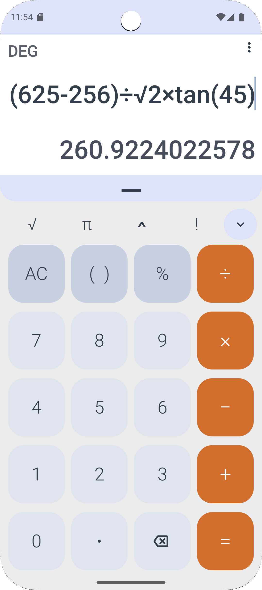
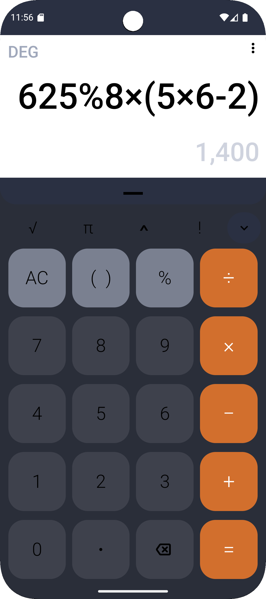
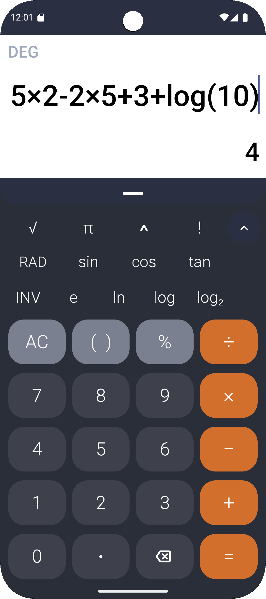
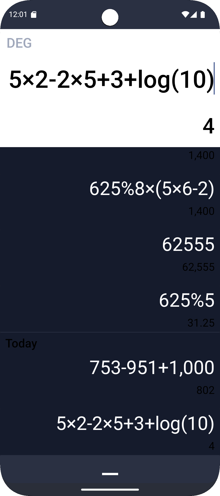
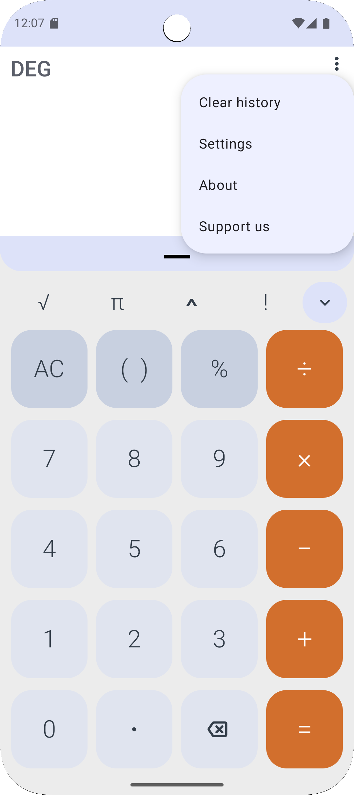
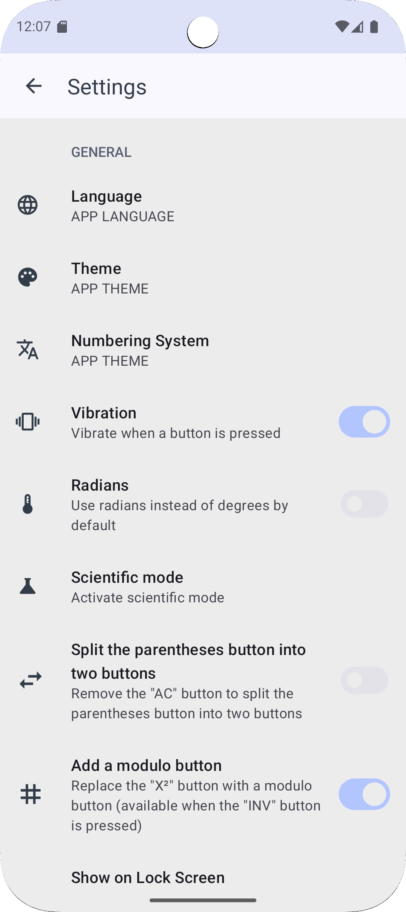
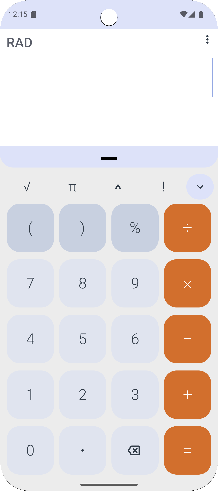

# Android Calculator

A modern, feature-rich calculator application for Android devices with a clean interface and powerful computation capabilities.

## ✨ Features

- **Basic Arithmetic**: Addition, subtraction, multiplication, and division
- **Scientific Functions**: Trigonometric functions, logarithms, exponentials, and more
- **Multiple Themes**: Light, dark, and AMOLED themes with Material Design 3 support
- **Calculation History**: Keep track of previous calculations with persistent storage
- **Expression Parsing**: Custom-built mathematical expression parser for accurate results
- **Responsive Design**: Optimized for both portrait and landscape orientations
- **Precision Control**: Configurable decimal precision and scientific notation
- **Intuitive UI**: Clean, modern interface with haptic feedback support

## 🔧 Technical Details

### Architecture
- **Language**: Kotlin
- **UI Framework**: Android Views with View Binding
- **Minimum SDK**: API 21 (Android 5.0)
- **Target SDK**: API 34 (Android 14)
- **Build System**: Gradle with Kotlin DSL

### Key Components
- **Custom Calculator Engine**: Built-in mathematical expression evaluator using BigDecimal for precision
- **Theme System**: Dynamic theming with support for system themes and custom color schemes
- **History Management**: JSON-based calculation history with configurable storage limits
- **Preference System**: Comprehensive settings with automatic migration support

## 📸 Screenshots

### Light Theme
<p align="center">
  
  
</p>

### Dark Theme
<p align="center">
  
  
</p>

### Scientific Mode & Features
<p align="center">
  
  
  
</p>

## 🚀 Getting Started

### Prerequisites
- Android Studio Arctic Fox (2020.3.1) or later
- JDK 8 or higher
- Android SDK with API 34

### Building the Project

1. Clone the repository:
   ```bash
   git clone <your-repository-url>
   cd Android_Calculator
   ```

2. Open in Android Studio or build from command line:
   ```bash
   ./gradlew assembleDebug
   ```

3. Install on device:
   ```bash
   ./gradlew installDebug
   ```

## 🧪 Testing

Run the test suite:
```bash
# Unit tests
./gradlew testDebugUnitTest

# Instrumented tests
./gradlew connectedAndroidTest

# All tests
./gradlew test
```

## 🎨 Customization

The calculator supports extensive theming through:
- **Color schemes**: Defined in `values/colors.xml` and `values-night/colors.xml`
- **Typography**: Configurable font families and sizes
- **Button styles**: Customizable button appearances and behaviors

## 📱 Supported Features

### Mathematical Operations
- Basic arithmetic (+, -, ×, ÷)
- Parentheses for operation precedence
- Percentage calculations
- Square root and power operations
- Factorial calculations
- Trigonometric functions (sin, cos, tan)
- Logarithmic functions (ln, log, log₂)
- Constants (π, e)

### User Interface
- Material Design 3 components
- Adaptive layouts for different screen sizes
- Smooth animations and transitions
- Accessibility support

## 🔒 Privacy

This calculator app:
- **No network permissions**: All calculations are performed locally
- **No data collection**: No user data is transmitted or stored externally
- **Minimal permissions**: Only requests essential permissions for functionality

## 🤝 Contributing

Contributions are welcome! Please feel free to submit pull requests or open issues for bugs and feature requests.

### Development Guidelines
- Follow Kotlin coding conventions
- Write unit tests for new functionality
- Update documentation for significant changes
- Test on multiple screen sizes and orientations

## 📄 License

This project is licensed under the MIT License - see the [LICENSE](LICENSE) file for details.

## 🏗️ Project Structure

```
app/
├── src/main/
│   ├── java/com/android/calculator/
│   │   ├── activities/          # UI activities
│   │   ├── calculator/         # Core calculation logic
│   │   ├── history/            # History management
│   │   ├── services/           # Background services
│   │   └── util/              # Utility classes
│   └── res/                   # Resources (layouts, strings, themes)
└── src/test/                  # Unit and integration tests
```
