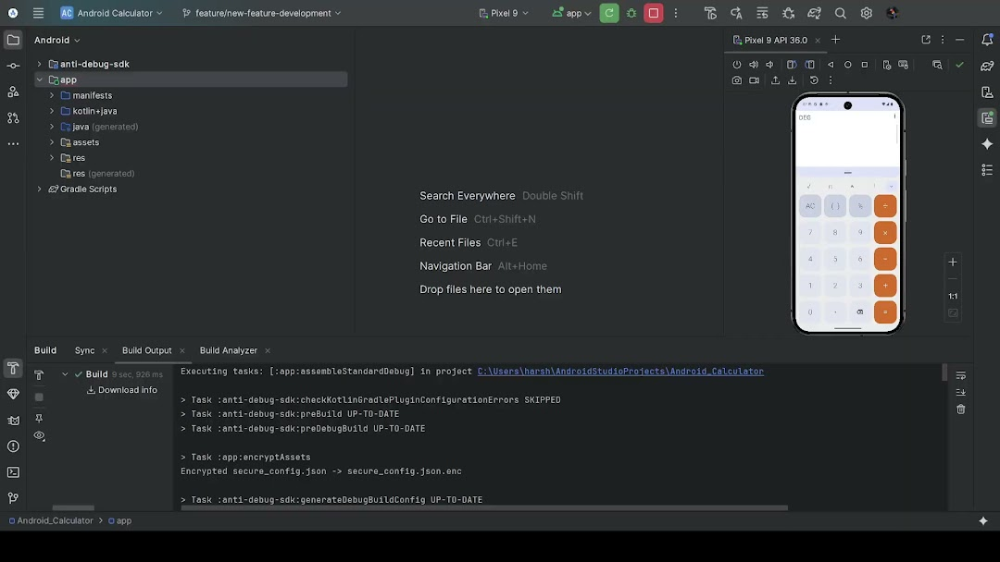

# Android Calculator with Advanced Security

This project is a comprehensive showcase of a multi-layered Android security framework, built into a simple, feature-rich calculator application.

The primary purpose is **not** the calculator itself, but to demonstrate an **integrated, open-source Obfuscation and Runtime Anti-Analysis (RASP) SDK** that is wired directly into an application's source code.

This project serves as a practical, hands-on implementation of the concepts discussed in our research paper on mobile application security.

[](https://drive.google.com/file/d/1WSiw9EyuAqa0Xjdt3qPYAF2MHCjfNicv/view?usp=drive_link)

## Features

## Calculator (Host App) Features
* **Basic Arithmetic**: Addition, subtraction, multiplication, division
* **Scientific Functions**: Trig functions, logarithms, exponentials
* **Multiple Themes**: Light, dark, and AMOLED with Material Design 3
* **Calculation History**: Persistent storage of previous calculations
* **Custom Expression Parser**: Built-in parser using `BigDecimal` for precision
* **Responsive Design**: Optimized for portrait and landscape

### Runtime Anti-Analysis (RASP)

* **Debugger Detection:** Actively detects attached debuggers (Java/JDWP, Native/Ptrace) and checks for debugging flags (`TracerPid`).
* **Root Detection:** Scans for `su` binaries, root-management apps (Magisk), and insecure system properties.
* **Emulator Detection:** Identifies virtual environments by checking hardware properties, sensors, and QEMU artifacts.
* **Tamper Detection:** Verifies the APK's runtime signature and file integrity (DEX checksums) to detect repackaging.
* **Hook Detection:** Scans for artifacts from common hooking frameworks like Frida and Xposed.
* **Behavioral Analysis:** Monitors for suspicious patterns, like execution timing anomalies, that indicate analysis.

### Static & Dynamic Obfuscation

* **Code Obfuscation:** Implements aggressive identifier renaming (classes, methods, fields) and package hierarchy flattening.
* **String Encryption:** Encrypts critical strings at build-time and decrypts them only at the moment of use.
* **Control Flow Obfuscation:** Modifies method logic to resist static analysis.
* **Native Code Protection:** Uses a JNI layer for low-level, high-performance security checks (e.g., process monitoring, ptrace).

## Technical Details

### Architecture
- **Language**: Kotlin
- **UI Framework**: Android Views with View Binding
- **Minimum SDK**: API 21 (Android 5.0)
- **Target SDK**: API 34 (Android 14)
- **Build System**: Gradle with Kotlin DSL

## Building the Application

### Prerequisites
- Android Studio (Iguana or later)
- JDK 21 or later
- Android SDK API 21-34
- Android NDK (for native C++ components)

### Build Commands

#### Quick Build
```bash
.\gradlew assembleaggressiveRelease
```

#### Clean Build
```bash
.\gradlew clean assembleaggressiveRelease
```

#### Using Build Script
```powershell
# Build with clean
.\build-release.ps1 -Clean

# Build without clean
.\build-release.ps1
```

### Build Variants

#### Standard Build
- Basic obfuscation
- Standard security features
- Debuggable

#### Aggressive Build (Recommended)
- Maximum obfuscation
- All security features enabled
- Optimized for production
- R8 shrinking enabled

## Security Configuration

### Selective Testing Mode

A key feature of this project is the **Selective Testing Configuration**, which allows you to enable or disable specific security checks for demonstration purposes.

#### Configuration
**Location:** `app/src/main/java/com/android/calculator/util/SelectiveTestingConfig.kt`:

Simply change the `currentConfig` variable to one of the predefined test scenarios:

```kotlin
// Default: All features enabled (production mode)
val currentConfig: TestingConfig = TestScenarios.allFeatures()

// --- OR ---

// Individual testing scenarios:
val currentConfig: TestingConfig = TestScenarios.debuggerOnly()   // Test only debugger detection
val currentConfig: TestingConfig = TestScenarios.emulatorOnly()   // Test only emulator detection
val currentConfig: TestingConfig = TestScenarios.rootOnly()       // Test only root detection
val currentConfig: TestingConfig = TestScenarios.tamperingOnly()  // Test only tampering detection
val currentConfig: TestingConfig = TestScenarios.noFeatures()     // All security features disabled
```

After changing the config, rebuild the app and try the corresponding attack (e.g., attach a debugger, run on an emulator) to see the RASP module in action.

### Obfuscation Configuration

The application uses aggressive obfuscation with the following features:
- **Class Renaming**: All classes renamed to single letters
- **Method Renaming**: All methods renamed to single letters
- **Field Renaming**: All fields renamed to single letters
- **Package Flattening**: Package hierarchy flattened to single level
- **String Encryption**: Critical strings encrypted
- **Control Flow Obfuscation**: Complex control flow patterns

## AntiDebug SDK

### Overview
The AntiDebug SDK provides comprehensive security protection through multiple detection mechanisms:

- **Debugger Detection**: Detects debugging tools and processes
- **Root Detection**: Identifies rooted devices and privilege escalation
- **Emulator Detection**: Recognizes virtual environments and emulators
- **Tamper Detection**: Verifies APK integrity and signature
- **Hook Detection**: Identifies runtime hooking frameworks
- **Behavioral Analysis**: Monitors for suspicious application behavior

### Integration
The SDK is automatically integrated into the aggressive build variant:

```kotlin
// In MainActivity.kt
AntiDebug.init(this, enableContinuousMonitoring = true)
val securityReport = AntiDebug.performSecurityCheck()

if (securityReport.hasThreats()) {
    // Handle security threats
    finishAffinity()
}
```

### Native Components
The SDK includes native C++ components for low-level security checks:
- **Process monitoring**
- **System call interception**
- **Memory protection**
- **Hardware fingerprinting**

## Project Structure

```
app/                                        # Main Calculator application module
├── src/main/java/com/android/calculator/
│   ├── activities/
│   │   └── MainActivity.kt                 # Main activity with security integration
│   ├── util/
│   │   ├── SelectiveTestingConfig.kt       # Testing configuration
│   │   ├── StringCrypto.kt                 # String encryption utilities
│   │   └── StringObfuscator.kt             # Obfuscation utilities
│   └── ...
├── proguard-optimized-shrinking.pro        # R8/ProGuard configuration
└── build.gradle.kts                        # Build configuration

anti-debug-sdk/                             # The standalone security module (RASP SDK)
├── src/main/java/com/example/antidebug/
│   ├── AntiDebug.kt                        # Main SDK interface
│   ├── DebuggerDetection.kt                # Debugger detection
│   ├── RootDetection.kt                    # Root detection
│   ├── EmulatorDetection.kt                # Emulator detection
│   ├── TamperDetection.kt                  # Tamper detection
│   └── ...
└── src/main/cpp/
    └── anti-debug-native.cpp               # Native security components
```

## Security Analysis

We verified the effectiveness of the protection layers by decompiling the final `aggressiveRelease` APK with **JADX**.

| Metric | Status |
| :--- | :--- |
| **Class Names** | 100% Obfuscated (e.g., `a`, `b`, `c`) |
| **Method Names** | \~95% Obfuscated (framework/SDK methods preserved) |
| **Field Names** | 100% Obfuscated |
| **Package Structure** | Flattened to single level |
| **String Constants** | Encrypted (runtime decryption) |
| **R8 Code Reduction** | \~60% (Unused code & resources removed) |
| **RASP Checks** | Active & wired in `MainActivity.kt` |

## Troubleshooting

### Build Issues
1. **Clean Build**: Use `.\gradlew clean assembleaggressiveRelease`
2. **NDK Issues**: Ensure NDK is properly installed
3. **Memory Issues**: Increase Gradle heap size in `gradle.properties`

### Security Testing
1. **Selective Testing**: Use individual feature testing for demonstrations
2. **Log Analysis**: Check logcat for security detection messages
3. **APK Verification**: Verify obfuscation using mapping files

### Performance
1. **Build Time**: Aggressive builds take longer due to obfuscation
2. **APK Size**: Optimized shrinking reduces final size
3. **Runtime**: Security checks have minimal performance impact

## License

This project is licensed under the MIT License - see the LICENSE file for details.
